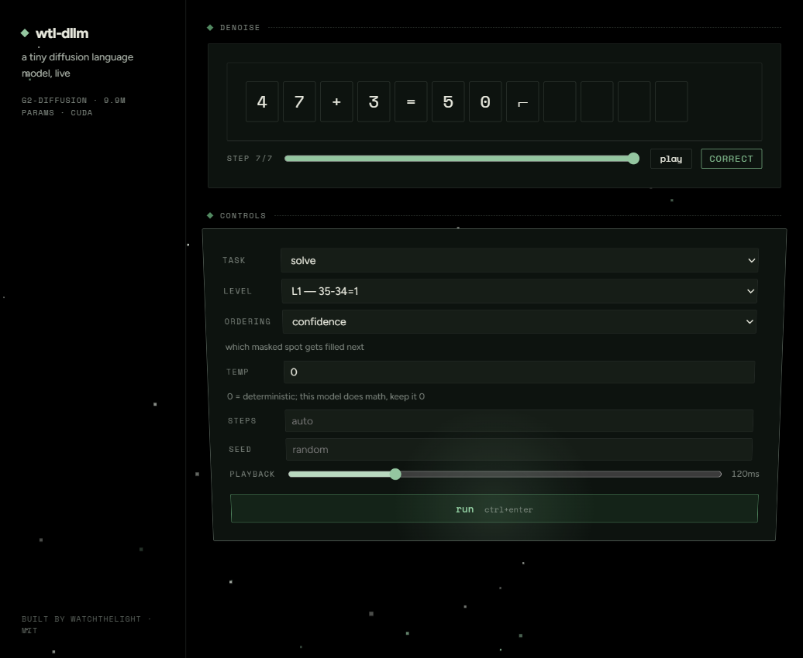

<!-- wtl-dllm · README.md -->

# wtl-dllm

A 10M-parameter diffusion language model you can watch think. Trained from scratch on one laptop in about 13 minutes, it solves arithmetic by unmasking tokens over a handful of refinement steps — and the web UI renders every step live, over a starfield, in a theme built for OLED black.

Why diffusion? Mostly because you can *see* it. A left-to-right model streams tokens; this one starts from a fully masked canvas and commits tokens wherever it's most sure, so an answer condenses out of noise in front of you. It also turns out to degrade ~3× more gracefully than its autoregressive twin when the arithmetic leaves its training distribution — more on that below.



## The honest numbers

Every model here is the same 10M-parameter trunk, same tokenizer, same data, same 20k-step budget — only the objective differs (masked diffusion vs next-token). Full configs ride with every number in `docs/results/`.

| L1 (2-digit add/sub) | heldout (unseen problems) | perturbed (censored digits) |
|---|---|---|
| diffusion, frozen corpus | **1.000** | **0.258** |
| diffusion, fresh data | 1.000 | 0.190 |
| ar twin, frozen corpus | 0.999 | 0.092 |

Reading guide: *heldout* is a 10% slice of the problem space the model never trained on (md5 split, same digit distribution) — the standard generalization claim, and it saturates. *Perturbed* holds out operand-final digits 8/9 from training entirely, which demands extrapolation to digit patterns never seen in those positions — a known open problem for small transformers. Both models fall off that cliff; the diffusion objective falls three times slower. Well-formed rate is 1.000 everywhere: nothing ever produced gibberish, which is worth saying out loud because both previously documented laptop attempts at from-scratch text diffusion did.

Also measured here, because the literature only knew it at 7–8B scale: at 10M params, *random* unmasking order beats *confidence* order on hard inputs (0.112 vs 0.084). Tiny models are confidently wrong; their confidence isn't worth ordering by. On easy inputs every ordering ties at 1.000, even at 2 denoising steps.

The other levels sharpen the story (`docs/results/levels.md` has the full table). L3 — multi-digit carries — generalizes at 96–97% for both architectures and holds ~80% even on censored digits: carrying is an algorithm, and algorithms transfer. L2 — multiplication — sits at 21.5% heldout for *both* models, which is exactly what commutativity buys you when unseen facts aren't derivable; a 10M model does not invent multiplication. And the infill everyone builds diffusion demos around had to be earned: the SFT-style objective never trains operand positions, so a mixed objective was added — after which operand infill grades 200/200 equation-valid with solve accuracy intact. Per-step latency: 5.3ms on the GPU, 6.8ms on CPU — realtime with room to spare.

## How it works, in ten lines

Training: sample a mask rate `t ~ U(0,1)` per sequence, mask each token with probability `(1−ε)t + ε`, run a plain bidirectional transformer (RoPE, SDPA, no time embedding — provably unnecessary), take cross-entropy on the masked positions, weight each by `1/p_mask`. That's the whole objective; it's BERT with a variable mask rate and a reweighting. Generation: start from all-mask, and each step let the model predict every masked cell, commit the top few by a chosen ordering (cosine schedule — cautious early, bold late), freeze them, repeat. Committed tokens never change, and the UI renders that truthfully. The deeper theory (why this equals a diffusion ELBO, why time conditioning drops out) is in `docs/architecture.md` and the research dossier under `research/`.

## Run it

```powershell
scripts\run.ps1        # server on :7311, ui on :5173
```

Needs: Python 3.11 + a torch that sees your GPU (CPU works, just slower), Node 20+. First run without a checkpoint serves a stub model so the UI still demos. Train your own in ~13 minutes on anything Ampere-class:

```powershell
python -m dllm.data.build --level 1
python -m dllm.train.trainer --preset gpu-10m --level 1 --mode diffusion --run-name mine
```

This repo trained on an RTX 5070 Laptop (8GB): ~100k tokens/s, 0.56GB VRAM.

## What it doesn't do

No speed claims — at this size everything is fast, and at large sizes the literature says diffusion decoding is *slower* than AR for math. No self-correction — a committed token is frozen, and the UI never pretends otherwise. No word problems — symbolic templates only, on purpose. No digit lengths beyond training ranges — that's the perturbed column telling you what happens. The model is a laboratory, not a calculator.

## The research

This build runs on a ~85-source literature review (LLaDA, MDLM/MD4/RADD, MaskGIT, the AR-vs-diffusion debate, all of it) distilled into `research/supersearch-dllm-dossier.md`, plus a full UI-methodology study in `research/pawtropolis-ui-recon.md`. The plan that turned research into repo is committed too, in `plan/` — phases 00 through 12, gates included. The whole paper trail is the point: every design decision traces to a source or an experiment in `docs/`.

## License

MIT — watchthelight
