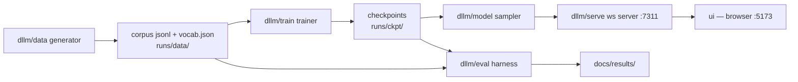

# Architecture

Every interface fixed here so the build phases never negotiate with each other.

## Dataflow



## Contracts

**1. Corpus.** JSONL rows: `{"text": "47+58=105", "level": 1, "split": "train|eval|eval_perturbed"}`. Vocab emitted by datagen at `runs/data/vocab.json` — ordered list, specials first: `[PAD] [MASK] [BOS] [EOS]`, then single chars `0-9 + - * / = x , :`. Canvas lengths (content padded with `[PAD]` after `[EOS]`): L1 12 · L2 12 · L3 16 · L4 16 · L5 32.

**2. Model presets** (in `dllm/config.py`):

| preset | d_model | layers | heads | ctx | ~params |
|---|---|---|---|---|---|
| cpu-5m | 256 | 6 | 8 | 64 | ~5M |
| gpu-10m | 320 | 8 | 8 | 96 | ~10M |
| gpu-17m | 448 | 8 | 8 | 128 | ~19M |
| gpu-30m | 512 | 10 | 8 | 128 | ~32M |

Default preset comes from `docs/results/env.json` (`gpu-10m` on this machine: RTX 5070 Laptop, 8GB, bf16).

**3. Objective.** Absorbing-state masked diffusion, the LLaDA-guidelines recipe: per sequence `t ~ U(0,1)`; `p_mask = (1−ε)t + ε` with `ε = 1e-3`; mask tokens i.i.d.; loss = cross-entropy on masked positions only, each term divided by `p_mask`, averaged over batch×length. Antithetic t-sampling available. **No time embedding anywhere** — provably unnecessary for absorbing-state diffusion (RADD/MDLM/MD4; dossier §Key Insights 1). Prompt positions are never masked when a prompt is supplied (the question stays fixed; the answer diffuses).

**4. AR twin.** Same trunk, `causal=True` switches the attention mask and swaps in next-token cross-entropy. Twin trains with identical tokenizer, data, and step budget. Every headline result ships as a diffusion-vs-AR pair — that comparison is the project's scientific control, not an accessory.

**5. Frame schema** (sampler → server → UI; one object per denoise step):

```json
{"step": 3, "total_steps": 12, "tokens": ["4","7","+","[MASK]","[MASK]"], "committed": [true,true,true,false,false], "conf": [0.98,0.97,0.99,0.0,0.0], "just_committed": [2], "done": false}
```

Final frame adds `"done": true, "answer": "105", "verdict": "correct|wrong|n/a"`. Committed entries never change across later frames — the sampler tests enforce this and the UI renders it truthfully.

**6. Server.** `GET /api/info` (run name, preset, params, device, available levels, ckpt step, vocab size) · `GET /api/levels` (canvas length + example per level) · `WS /ws/generate` accepting `{level|prompt, canvas_len, steps, ordering, temperature, throttle_ms, infill, seed}` and streaming frames. Port **7311**, CORS for `http://localhost:5173` only.

**7. UI.** Svelte 5 + Vite SPA, no SSR, hand-rolled OKLCH token CSS (seed hue 152), square starfield canvas at z −1, denoise board replaying frames. Talks to 7311 only.

## Decision log

- **Absorbing noise** over uniform/hybrid: all mature tooling and every strong result use it; hybrid self-editing is a stretch goal only. (dossier §Tradeoffs)
- **Char-level, digit-atomic tokenizer**: BPE/WordPiece chunk digits inconsistently and measurably hurt arithmetic.
- **Fixed short canvases** over block diffusion: block mode fixes problems (variable length, caching) this scope doesn't have; deferred.
- **SDPA** over flash-attn: flash-attn doesn't build on native Windows; at ≤32M params SDPA is plenty.
- **Svelte + hand CSS** over component kits: porting a proven in-house methodology beats adopting a generic one.
- **External answer checker** over model self-correction: vanilla absorbing samplers freeze committed tokens; pretending otherwise would be a lie the UI repeats every frame.

## Risk register

| Risk | Mitigation |
|---|---|
| Gibberish output (0-for-2 prior laptop attempts) | Gate G1 + AR twin control + encoder-finetune pivot |
| EMA trap (0.9999 ≈ untrained net at short runs) | EMA 0.995; eval raw and EMA weights, keep the better honestly |
| Tiny-model confidence miscalibration | Ordering ablation (random may beat confidence; measure, don't assume) |
| Thermal throttling on laptop | tokens/s logged over time; wall-clock claims avoided |
| Eval self-deception on templates | Perturbed-by-construction holdouts; config string on every number |
| Windows toolchain | SDPA only; deps pinned; no CUDA-extension packages |
